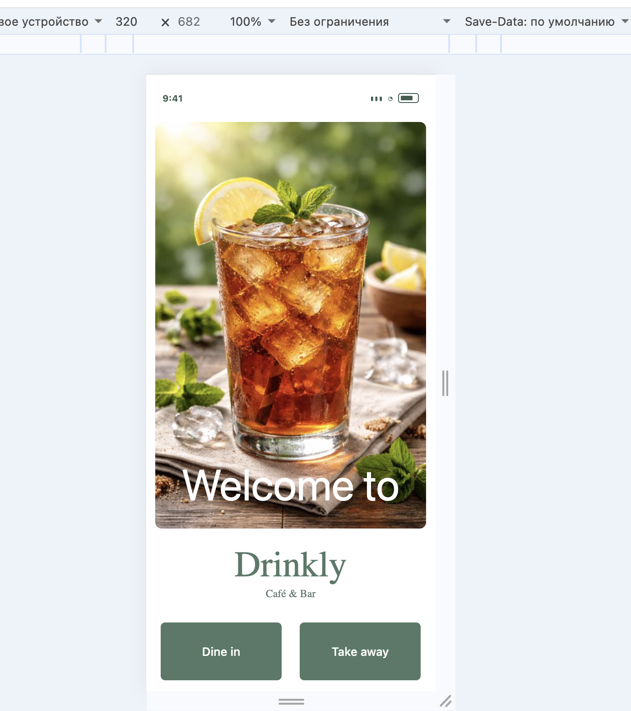
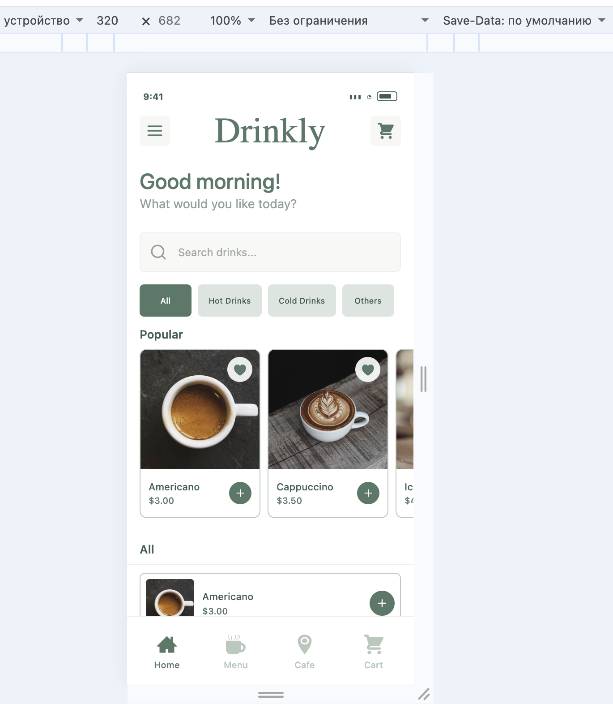
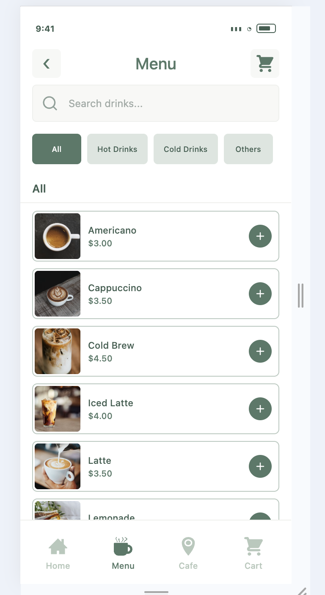
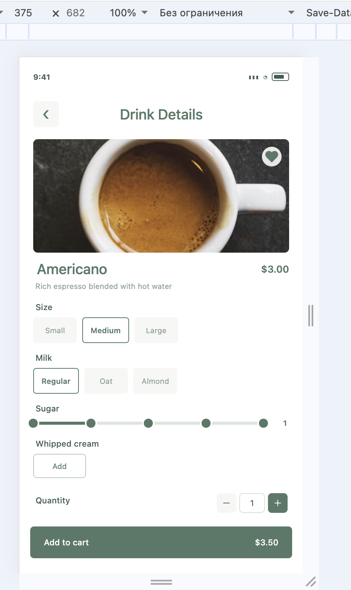
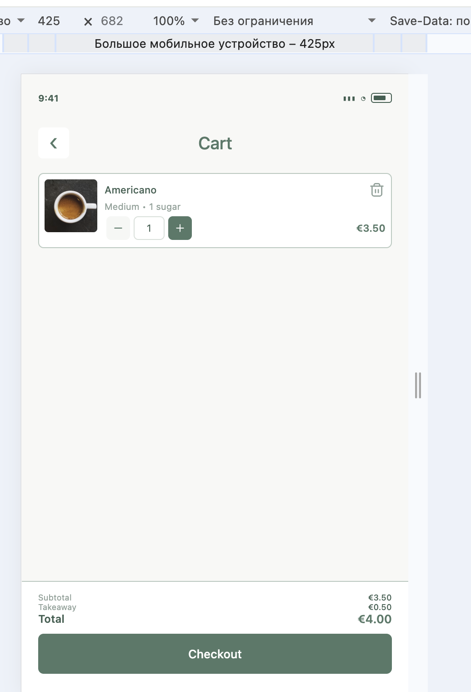
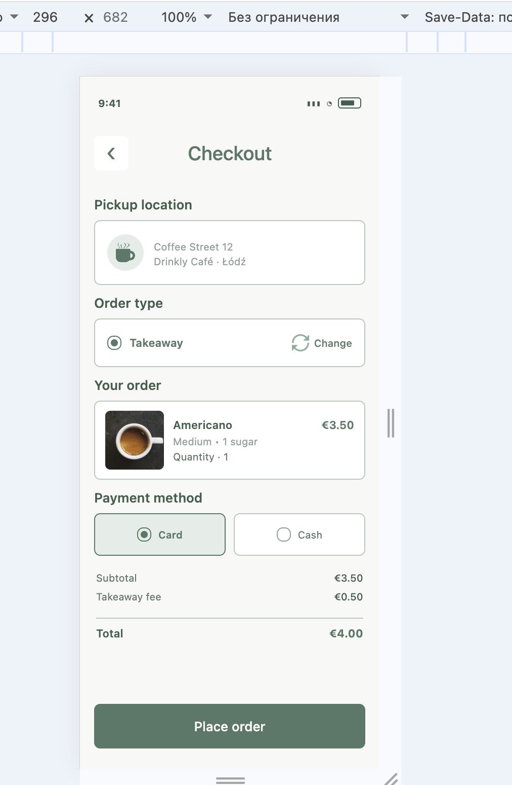
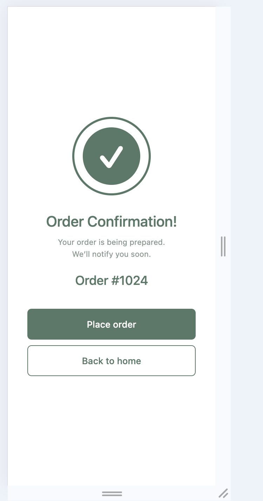

# Drinkly

Drinkly is a cross-platform mobile application for ordering drinks in a café.
The application was developed with React Native, Expo and TypeScript and expanded with a custom REST API, improved search and category filtering, navigation parameters, Context API and Redux Toolkit.

## Project Links

- **GitHub Repository:** [Drinkly — Final Project](https://github.com/Your-Natka/Nataliia_Bodnarchuk_cross_final_project)
- **UX/UI Presentation:** [QR-Drinkly-UX-UI.pdf](docs/QR-Drinkly-UX-UI.pdf)
- **Wireframes:** [QR-Drinkly-Wireframes.pdf](docs/QR-Drinkly-Wireframes.pdf)

## Project concept

Drinkly is designed as a simple digital café ordering experience:

**Welcome → Home → Menu → Drink Details → Cart → Checkout → Confirmation**

The application allows users to browse drinks, search and filter the catalog, open detailed drink information, customize an order, add drinks to the cart and complete the checkout flow.

## Technologies

- React Native
- Expo
- TypeScript
- React Navigation
- Context API
- Redux Toolkit
- Express
- REST API
- React Native Reanimated
- Expo Atlas
- CSS Modules for web-specific animated components

## Main functionality

### Drink catalog

The application contains a catalog of 37 drinks provided through a custom REST API.

The catalog includes:

- Coffee
- Tea
- Cold Drinks
- Juice
- Water
- Cocoa

The Home screen provides the following menu groups:

- All
- Hot Drinks
- Cold Drinks
- Others

Drinks are displayed alphabetically within the selected catalog.

### Search and filtering

The Home screen contains a search field with:

- drink name search;
- search focus state;
- category selection;
- clear button;
- category-based filtering;
- vertical catalog scrolling;
- sticky category title.

Search categories include:

- Coffee
- Tea
- Cold Drinks
- Juice
- Water
- Cocoa

When a category is selected, the main catalog displays only drinks belonging to that category.

The category filter is based on the drink's `category` field, while the Home tabs use the separate `menuCategory` field. This allows cases such as Iced Tea to appear in the Cold Drinks menu group while still belonging to the Tea search category.

## Custom REST API

A custom Express REST API was added as the main data source for the drink catalog.

The API is located in:

```text
server/
├── data/
│   └── drinks.ts
└── index.ts
```

### API endpoints

Health check:

```text
GET /api/health
```

Returns the current API status.

All drinks:

```text
GET /api/drinks
```

Returns the complete drink catalog.

Single drink:

```text
GET /api/drinks/:id
```

Returns one drink by its ID.

Drink images are served by the same server from:

```text
/assets/images/api-drinks/
```

### API client

The application communicates with the API through:

```text
src/api/drinksApi.ts
```

The client provides:

```text
fetchDrinks()
fetchDrinkById(id)
```

This keeps API communication separate from UI components and makes the data layer easier to maintain.

## New functionality

The main project expansion is the integration of a custom REST API.

The API replaces the previous external coffee API and provides a controlled catalog specifically for the Drinkly application.

The new architecture is:

```text
server/data/drinks.ts
        ↓
Express REST API
        ↓
src/api/drinksApi.ts
        ↓
Home / Menu / Drink Details
        ↓
Context API + Redux Toolkit
```

The API integration also introduced a new Drink Details flow for API drinks.

## Drink Details

When a user selects a drink, the application navigates to:

```text
DrinkDetails
```

The selected drink ID is passed through React Navigation:

```text
DrinkDetails: { drinkId: string }
```

The Stack Navigator then requests the corresponding drink from:

```text
GET /api/drinks/:id
```

This demonstrates navigation with parameters and dynamic data loading.

From the Drink Details screen, users can select available drink options and add the configured drink to the cart.

## State management

The application uses both Context API and Redux Toolkit.

### Context API

Context API is used for application-level state that is shared between screens but does not represent the shopping cart itself.

`AppContext` manages:

- order mode;
- payment method;
- selected drink;
- favorites;
- favorite toggling;
- order reset.

`ThemeContext` manages application theme information.

This keeps global UI and application preferences separate from cart state.

### Redux Toolkit

Redux Toolkit is used for the shopping cart.

The cart state is implemented in:

```text
src/store/cartSlice.ts
src/store/store.ts
```

Redux manages:

- adding drinks;
- removing drinks;
- changing quantity;
- clearing the cart.

Each cart item stores:

- drink;
- quantity;
- selected options;
- option label.

The same Redux cart is reused for drinks loaded from the REST API, so API products do not require a separate cart implementation.

## Navigation

The application uses React Navigation with three levels:

```text
Stack Navigator
    ↓
Drawer Navigator
    ↓
Bottom Tab Navigator
```

### Main screens

- Welcome
- Home
- Menu
- Cart
- Café
- Drink Details
- Checkout
- Payment
- Order Confirmation
- Burger Menu

The navigation structure is defined in:

```text
src/navigation/
├── AppNavigator.tsx
├── DrawerNavigator.tsx
├── StackNavigator.tsx
├── TabNavigator.tsx
└── navigationTypes.ts
```

## Project structure

```text
.
├── assets/
│   ├── icons/
│   └── images/
├── screenshots/
├── server/
│   ├── data/
│   │   └── drinks.ts
│   └── index.ts
├── src/
│   ├── api/
│   │   └── drinksApi.ts
│   ├── components/
│   ├── constants/
│   ├── context/
│   ├── hooks/
│   ├── navigation/
│   ├── pages/
│   ├── store/
│   ├── types/
│   └── utils/
├── App.tsx
├── app.json
├── package.json
└── README.md
```

### Components

Reusable UI components are located in:

```text
src/components/
```

Examples include:

- `DrinkCard`
- `CategoryTabs`
- `SearchBar`
- `BottomNavigation`
- `CartItem`
- `QuantityControl`
- `OptionButton`
- `CheckoutChoice`
- `Header`
- `BurgerMenu`

This keeps screens focused on application logic and improves component reusability.

## Performance and optimization

The project uses several React and Expo optimization techniques:

- `React.memo` for reusable components where appropriate;
- `useMemo` for derived data;
- `useCallback` for stable callbacks;
- React Native Reanimated for animations;
- responsive dimensions for different screen sizes;
- separated constants for colors, dimensions, typography and categories.

## Responsive design

The application supports different screen widths and adapts:

- horizontal padding;
- search field layout;
- category tabs;
- drink cards;
- navigation elements.

The interface was tested on different viewport sizes during development.

## Screenshots

### Welcome



### Home



### Menu



### Drink Details



### Cart



### Checkout



### Order Confirmation



## Main user flow

```text
Welcome
   ↓
Home
   ↓
Search / Category
   ↓
Drink Details
   ↓
Customize drink
   ↓
Add to Cart
   ↓
Cart
   ↓
Checkout
   ↓
Payment
   ↓
Order Confirmation
```

## Running the project

Install dependencies:

```bash
npm install
```

### Start the REST API

Run:

```bash
npm run api
```

The API will be available at:

```text
http://localhost:3000
```

Health check:

```text
http://localhost:3000/api/health
```

### Start Expo

In a separate terminal:

```bash
npm start
```

For web:

```bash
npx expo start --web
```

## TypeScript check

The project can be checked with:

```bash
npx tsc --noEmit
```

## Development decisions

The project was expanded without replacing the existing application architecture.

The main decisions were:

1. Replace the previous external coffee API with a custom REST API.
2. Keep API communication inside a separate API layer.
3. Reuse existing Drink Details, Cart and customization functionality.
4. Use navigation parameters to load a selected drink dynamically.
5. Use Context API for shared application-level state.
6. Use Redux Toolkit for shopping cart state.
7. Keep reusable UI elements in separate components.
8. Separate menu grouping from drink categories to support flexible filtering.

This approach keeps the application modular while allowing new functionality to be added without duplicating existing logic.

## Result

The final Drinkly application provides:

- a reusable drink catalog;
- a custom REST API;
- dynamic drink loading;
- search and category filtering;
- drink details with navigation parameters;
- drink customization;
- favorites;
- Redux-powered cart;
- checkout and payment flow;
- responsive UI;
- modular React Native architecture.
